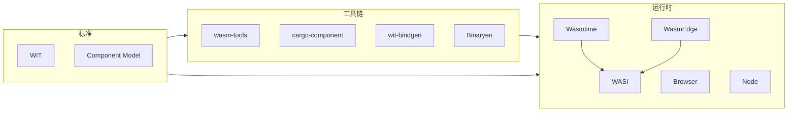

# 生态与版图

- 运行时：Wasmtime、WasmEdge、Node、浏览器、Spin 等
- 工具链：wasm-tools、cargo-component、wit-bindgen、Binaryen
- 标准化：WASI、组件模型、WIT

建议：将“运行时/工具链/标准”作为三视图来理解项目选择与兼容性。

## 版图关系（示意）

三视图清单：
- 运行时：装载与执行能力、WASI/组件支持、嵌入 API
- 工具链：编译/组件化/组合/优化与调试
- 标准：WIT/WASI/组件模型与兼容性
