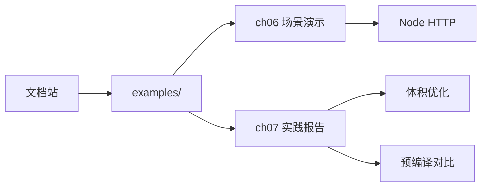

# 快速上手

- 安装 Node >= 18，`yarn start` 打开文档站
- 安装 wasm-tools 与 Wasmtime，运行 `examples/` 下示例
- 先跑 ch06 的 Node HTTP 与 ch07 的两个脚本，快速建立直观感受

## 路径图（示意）



## 最小命令清单

```bash
# 文档站
yarn
yarn start

# 体积优化报告
cd examples/ch07/size-opt && bash run.sh && cat out/report.md

# 预编译对比
cd ../precompile-wasmtime && bash run.sh && cat out/report.md
```
