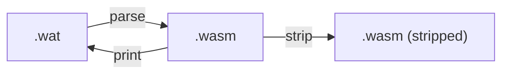
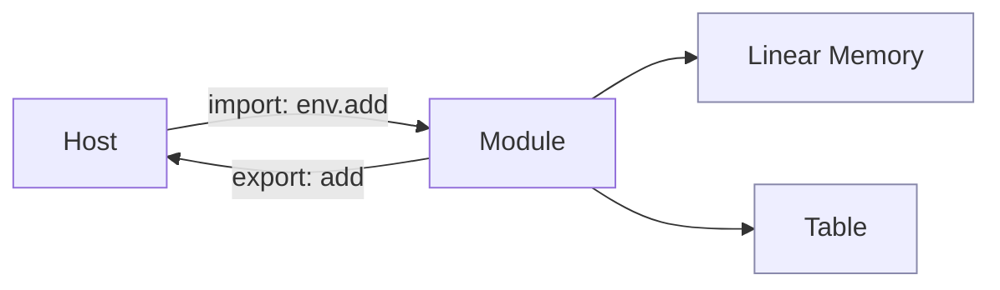

本章目标：理解 WASM 是什么样的字节码与执行模型，掌握基本类型、线性内存、导入/导出与安全沙箱。

> 快速跳转：完整的运行指南与依赖矩阵见 `examples/README.md`（总览导航 + 工具链准备 + FAQ）。

## 模块导览（本章深入）

- 文本与二进制：.wat ↔ .wasm 转换与 strip → ./text-format
- 入口/导入导出与内存/表：ABI 与数据交换 → ./linking-memory-table

## 2.1 Text 与 Binary：.wat 与 .wasm

- .wat：可读的文本格式（s-expression）。
- .wasm：紧凑的二进制格式，供运行时加载。

最小示例位于 `examples/ch02/min.wat`，可用 `wasm-tools` 转换与验证：

```bash
# 将文本格式转为二进制
wasm-tools parse examples/ch02/min.wat -o examples/ch02/min.wasm

# 查看模块结构
wasm-tools print examples/ch02/min.wasm | head -n 50
```

## 2.2 类型系统与函数签名

- 数值类型：i32, i64, f32, f64
- 函数类型：参数与返回值列表，例如 `(func (param i32 i32) (result i32))`
- 指令栈：操作数通过栈传递，类型在验证阶段静态检查。

## 2.3 线性内存模型

WASM 使用一段“线性内存”（按页增长，1 页 = 64KiB）。宿主负责将其与宿主地址空间隔离。

- 读写通过 `i32.load`, `i32.store` 等指令完成。
- 越界会触发陷阱（trap），确保内存安全。

## 2.4 模块、导入与导出

- 模块（module）是基本装载单元。
- 通过 `import` 引入宿主提供的函数/内存/表；通过 `export` 暴露给宿主。

示例结构：

```wat
(module
	(func (export "add") (param i32 i32) (result i32)
		local.get 0
		local.get 1
		i32.add))
```

## 2.5 安全模型与确定性

- 沙箱：模块默认没有 I/O 能力，必须由宿主显式赋予（见第 4 章 WASI）。
- 确定性：指令语义稳定、平台无关，适合分布式/区块链等场景。

---

小结：你已掌握 WASM 的基本构件。下一章将比较主流运行时与工具链，并通过 Rust 生成 WASM 后在 Wasmtime 中运行。

---

## 文本与二进制（摘录）



详见：./text-format

## 导入/导出与内存/表（摘录）



详见：./linking-memory-table
