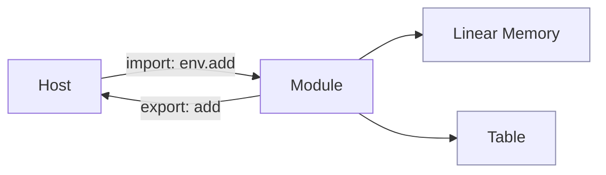

id: basics-linking-memory-table
title: 入口、导入导出与内存/表
sidebar_label: 导入/导出与内存/表
sidebar_position: 2
---

# 入口、导入导出与内存/表

- start 函数、import/export 的 ABI 基础
- 线性内存与表的用途、边界
- 最小示例的栈/堆与 host 交互

## 调用与内存/表关系（示意）

要点：
- import/export 定义了主客边界；
- 线性内存用于数据交换（需约定布局与编码，如 UTF-8）；
- 表通常用于函数引用与间接调用。

常见陷阱：
- 字符串与结构序列化不一致导致的错位；
- 内存越界（需边界检查与长度校验）。
