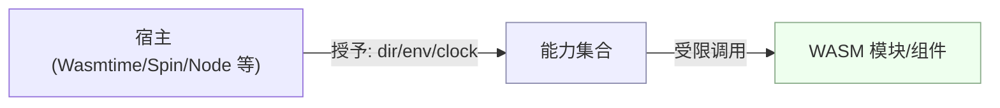

# 能力模型与权限授予

WASI 的核心是“能力最小化（Least Privilege）”。模块默认没有文件、网络、时钟等能力，需由宿主显式授予。

## 预览版对比（preview1 vs preview2）

- preview1：接口更偏 POSIX，粒度相对粗，组合性受限。
- preview2：面向组件模型，基于接口类型统一建模，强调能力授予与可组合性。

提示：大多数现代运行时正逐步对齐 preview2 能力模型（如 wasmtime）。

## 能力授予清单（常见）

- 文件系统：预打开目录
	- 例：`--dir=.` 或 `--mapdir /sandbox=.`
- 环境变量：
	- 例：`--env FOO=bar`
- 随机数/时钟：常为默认可用（依运行时策略）
- 网络：根据运行时与 API 支持情况开启（随标准推进）

运行示例（wasmtime）：

```bash
# 预打开当前目录，注入环境变量
wasmtime run --dir=. --env APP_ENV=dev app.wasm

# 映射宿主目录为客体内路径 /sandbox
wasmtime run --mapdir /sandbox=. app.wasm
```

## 安全建议（工程实践）

- 最小权限：仅授予需要访问的目录/变量/网络；按功能分割组件，缩小爆破面。
- 输入不可变：优先使用只读数据/只读目录；输出写入隔离目录。
- 可审计：将授予策略“基础设施化”，记录到 IaC 或脚本中，便于审查与回溯。

## 错误模式与排错

- 权限不足：EACCES/ENOENT（未预打开目录或路径超出沙箱）。
- 环境变量缺失：在运行时侧默认不注入，需要 `--env` 或宿主 API 显式设置。
- 时钟/随机：可能随运行时策略受限；必要时在宿主开启或降级使用。

排错建议：
- 打印当前工作目录与入参；
- 在宿主层输出授予清单（dir/env 等）；
- 最小化重现脚本（方便 CI 复现）。

## 运行时差异（要点）

- Wasmtime：preview2 支持积极，`--dir/--mapdir/--env` 常用。
- Spin：以配置文件授予能力（HTTP/FS/env 等），契合 preview2 与组件模型。
- 其他运行时：能力命名与授予方式可能不同，应查阅各自文档并编写兼容层。

## 示意图：宿主授予与组件边界


