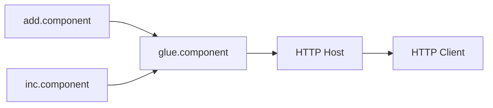

# 组合与宿主

组件组合可以在不修改组件代码的情况下，用 WIT 与 glue 进行拼装，以实现跨语言复用与演进。

## 组合方式

- 静态组合：`component compose` 产生新组件；
- 宿主组合：由宿主在运行时按路由/策略调用多个组件；
- 胶水组件：实现统一接口，内部再调度其他组件。

流程示意：



## 脚本化例子

参考 `examples/ch05/components_composition`：

```bash
bash componentize-ch03.sh       # 从 ch03 核心模块生成组件
bash compose-add-inc.sh         # 组合 add + inc
bash build-components.sh        # 快速构建三个组件并查看 WIT
bash run-glue.sh 2 3            # 调用 glue 组件导出
```

宿主侧更复杂的组合参考 `examples/ch06/component_http_host`（含池化与多模式）。

## 组合策略权衡

- 静态组合：启动更快、交付简单，但灵活性较低；
- 宿主组合：灵活可观测，可做 A/B 或灰度，但需要额外的调度与缓存；
- 胶水组件：统一接口、稳定调用点，有利于多语言协作与演进。

错误处理建议：
- 用 result/variant 承载业务错误，避免 panic 传递到 Host；
- Host 侧记录组件调用耗时/错误码，形成可观测基线；
- 对跨组件调用链设置超时与重试策略。
