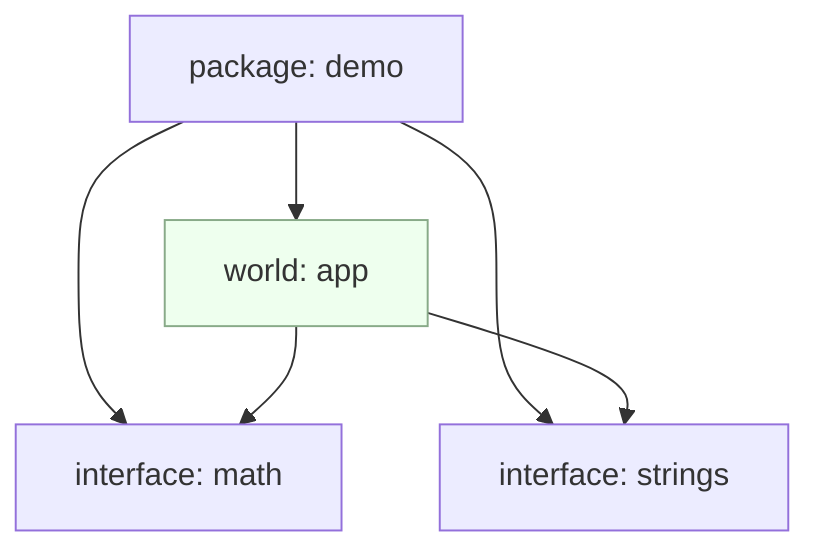

# WIT 与 World

WIT（WebAssembly Interface Types）用于描述跨语言/组件的接口契约。

## 核心概念

- package：接口包的逻辑命名空间，包含多个接口/世界。
- interface：函数、类型、错误码等的集合。
- world：将多个接口组合成“可实现/可使用”的集合，作为组件边界。

关系示意：



## 绑定与生成

- `cargo component add`：为 Rust 工程加入组件化支持
- `wit-bindgen`：在多语言场景下生成绑定代码
- `wasm-tools component new`：将 core wasm 封装为 component

常见流程：

```bash
# Rust 组件化（示例）
cargo component new my-demo
cargo build -Zunstable-options --target wasm32-wasi --release

# 查看组件 WIT
wasm-tools component wit target/wasm32-wasi/release/my-demo.component.wasm
```

更多可见 `examples/ch05/components_composition`。

## 类型与版本化建议

- 跨语言类型：优先使用基础类型与 record/variant，避免深层嵌套递归结构；
- 错误模型：以 result/variant 表达错误码，便于观测与聚合；
- 版本演进：
	- 新增字段尽量设为可选（Optional），避免破坏性变更；
	- 更名或弃用通过新接口保留旧接口一段时间；
	- 以 world 维度进行“能力分组”，控制依赖面。
