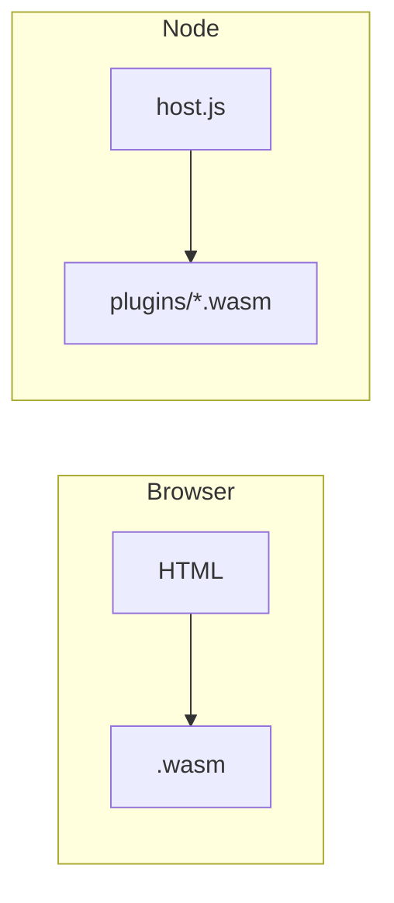

# 浏览器与 Node 宿主

## 浏览器
- 使用 `WebAssembly.instantiateStreaming(fetch(...))` 直接流式编译执行；
- 需通过静态服务提供 .wasm，避免 CORS/文件协议限制；
- 示例：`examples/ch06/browser`。

常见坑：
- 本地直接 file:// 打开会受 CORS/跨源限制，需本地静态服务器；
- 某些环境不支持 instantiateStreaming（需先 fetch 再 arrayBuffer 再 instantiate）。

## Node（插件式宿主）
- 通过 `WebAssembly.Module/Instance` 或 `wasmtime` Node 绑定加载；
- 以基于目录的 `plugins/*.wasm` 作为扩展点；
- 示例：`examples/ch06/plugin_host`。

排错建议：
- 插件必须满足期望的导出签名；
- 小心 Node 与 Wasmtime 调用方式差异（内存/字符串编码）。

最小示意：

