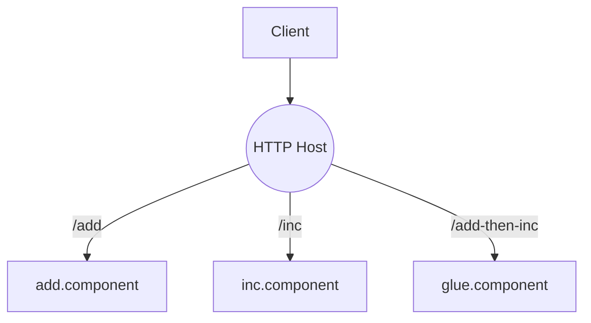

# HTTP 与组件化服务

典型三种方式：

1) Node 原生 HTTP：在路由中加载并调用 Wasm；
2) Spin（WASI HTTP）：以组件实现 HTTP 处理函数；
3) 组件模型 HTTP 宿主：Rust Host + Wasmtime 组件 API，池化复用组件实例。

路由结构示意：

参考：`examples/ch06/http_server_node`、`examples/ch06/wasi_http_spin`、`examples/ch06/component_http_host`。

## 池化与背压

- 组件实例池：降低冷启动与编译开销；
- 背压策略：限制并发、队列长度与超时；
- 热路径：对热点接口做输入校验前移与快速失败。
