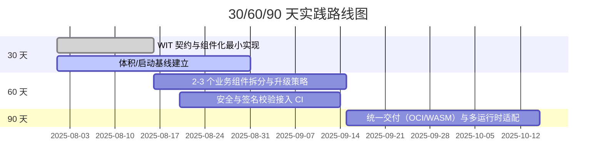

id: outlook-trends-and-roadmap
title: 趋势与路线图
sidebar_label: 趋势与路线图
sidebar_position: 1
---

# 趋势与路线图

## 生态趋势

- 组件模型成熟度与生态采纳持续提升（WIT 工具链完善）；
- 容器/插件系统融合（OCI Artifact、runwasi、Spin 等）；
- 安全与可观测性从“可选项”变为“默认需求”。

## 实践路线图（示意）

## 度量与风险

- 度量：以“体积/启动/内存/错误率”为主线，建立可比基线；
- 风险：
	- 组件模型/预览规范变更带来的兼容性；
	- 多运行时差异导致的行为偏差；
	- 签名/供应链与 SBOM 管理的缺失。
