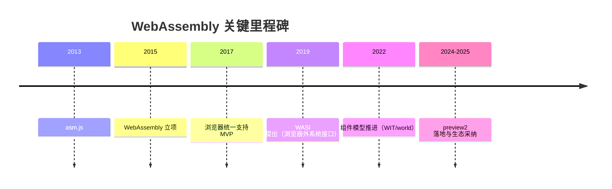

# 历史与演进

- WebAssembly 的起源：asm.js、Emscripten 到 MVP
- 浏览器内与浏览器外：WASI 的出现
- 组件模型：从模块到世界（world）

要点：以性能与可移植性为核心，生态逐步走向“多运行时、多语言、可组合”。

## 时间线

```mermaid
timeline
	title WebAssembly 关键里程碑
	2013 : asm.js
	2015 : WebAssembly 立项
	2017 : 浏览器统一支持 MVP
	2019 : WASI 提出（浏览器外系统接口）
	2022 : 组件模型推进（WIT/world）
	2024-2025 : preview2 落地与生态采纳
```

注：时间节点为近似标记，具体以标准仓库时间线为准。
