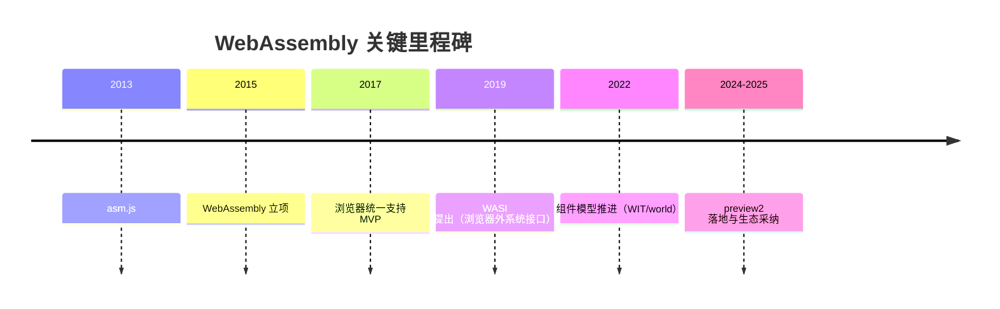

# 历史与演进

- 起源与动机：从 asm.js、Emscripten 到 Wasm MVP，目标是在浏览器中以接近原生的性能安全地运行 C/C++ 等语言产物。
- 浏览器统一：Chrome/Firefox/Safari/Edge 在 2017 年前后落地 MVP，确立跨浏览器一致语义。
- 浏览器之外：WASI 的提出让 Wasm 拥有标准化、可移植的“系统能力”，脱离浏览器在服务器/边缘/桌面可用。
- 下一阶段：组件模型（Component Model）与接口类型（WIT）提供稳定 ABI 与跨语言的组合能力。

要点：以性能与可移植性为核心，生态逐步走向“多运行时、多语言、可组合”。

## 时间线

注：时间节点为近似标记，具体以标准仓库时间线为准。更多关于 WASI 与组件模型的细节，见第 4 章与第 5 章。

## 路径延伸

- 运行时与工具链总览：../03-runtimes-toolchain/runtimes-toolchain
- WASI 能力模型与示例：../04-wasi/wasi
- 组件模型与 WIT/world：../05-component-model/component-model
