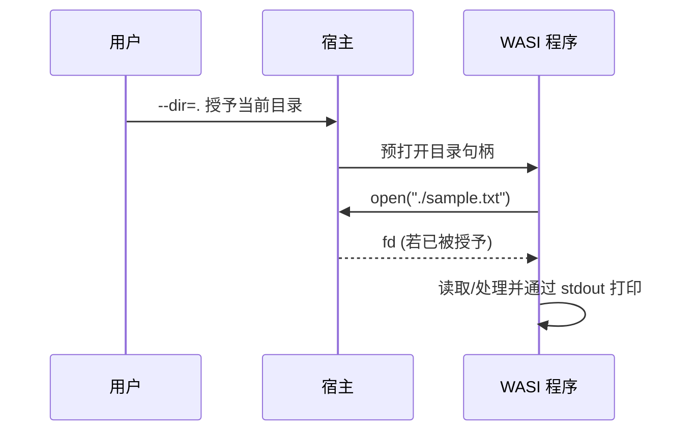

# I/O 与时钟

WASI 通过能力授予提供受控 I/O。本节覆盖文件、stdio 与时钟接口的要点。

## 文件系统与 stdio

- 预打开目录后，程序可在沙箱内按相对路径访问。
- stdio（stdin/stdout/stderr）可用于简单交互与日志。

示意：



## 时间/时钟接口

- 常见接口：`clock_time_get`（运行时封装）。
- 典型用途：打点/日志/过期判断。

注意：
- 精度与时区：WASI 提供的是原始时间源（如纳秒级 epoch），不含本地化/时区转换；
- 可移植性：不同运行时可能对高精度时钟权限有不同策略；
- 错误处理：当缺乏能力时应显示友好信息并降级。

## 运行示例

参考 [examples/ch04/wasi_fs_time](https://github.com/Thneoly/beyond-wasm/tree/main/examples/ch04/wasi_fs_time)：

```bash
rustup target add wasm32-wasi
cd examples/ch04/wasi_fs_time
cargo build --release --target wasm32-wasi
wasmtime --dir=. target/wasm32-wasi/release/wasi_fs_time.wasm sample.txt
```
