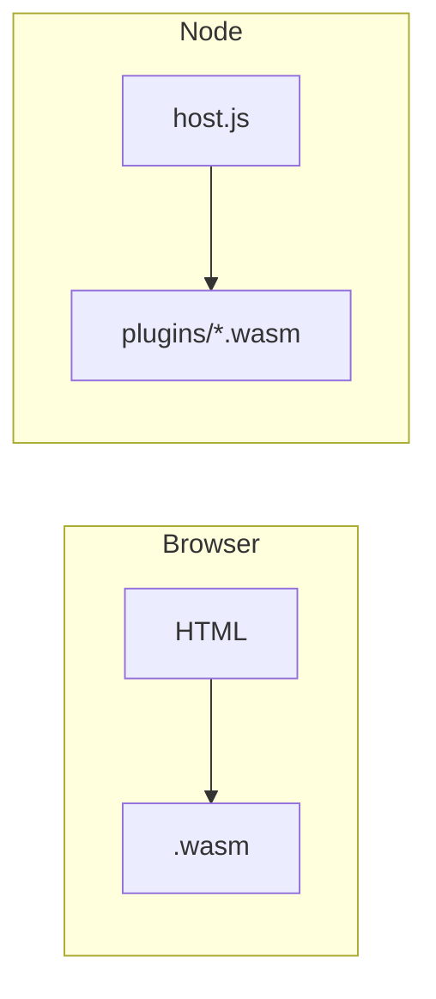

# 浏览器与 Node 宿主

## 浏览器
- 使用 `WebAssembly.instantiateStreaming(fetch(...))` 直接流式编译执行；
- 需通过静态服务提供 .wasm，避免 CORS/文件协议限制；
- 示例：[examples/ch06/browser](https://github.com/Thneoly/beyond-wasm/tree/main/examples/ch06/browser)。

常见坑：
- 本地直接 file:// 打开会受 CORS/跨源限制，需本地静态服务器；
- 某些环境不支持 instantiateStreaming（需先 fetch 再 arrayBuffer 再 instantiate）。

## Node（插件式宿主）
- 通过 `WebAssembly.Module/Instance` 或 `wasmtime` Node 绑定加载；
- 以基于目录的 `plugins/*.wasm` 作为扩展点；
- 示例：[examples/ch06/plugin_host](https://github.com/Thneoly/beyond-wasm/tree/main/examples/ch06/plugin_host)。

排错建议：
- 插件必须满足期望的导出签名；
- 小心 Node 与 Wasmtime 调用方式差异（内存/字符串编码）。

最小示意：

## 插件系统与扩展点（深入）

目标：以目录或注册表形式加载第三方插件（.wasm/.component.wasm），实现“宿主稳定、插件可进化”。

推荐实践：
- 约定统一 ABI/世界：例如 `world plugin:process(text) -> result<text, error>`；
- 目录发现与签名校验：`plugins/*.component.wasm`，加载前校验签名/清单；
- 沙箱权限：Node 侧仅暴露必要的 host functions，WASI 能力最小化；
- 版本演进：通过新世界/接口扩展而非破坏性修改，旧插件可继续运行。

错误与隔离：
- 使用 result/variant 回传业务错误，避免 panic 影响宿主；
- 为每个插件实例设置超时与内存上限；
- 观测：记录插件名、版本、错误码与耗时，便于定位问题插件。

示例：参见 [examples/ch06/plugin_host](https://github.com/Thneoly/beyond-wasm/tree/main/examples/ch06/plugin_host)。
