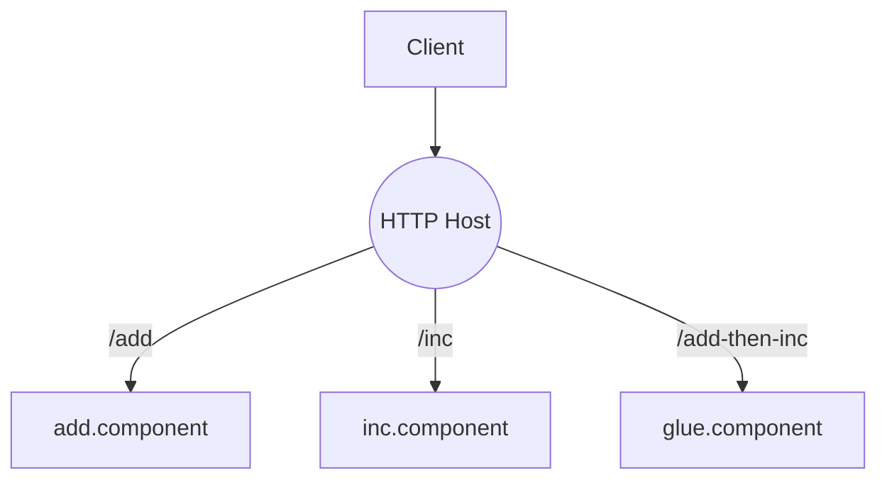

# HTTP 与组件化服务

典型三种方式：

1) Node 原生 HTTP：在路由中加载并调用 Wasm；
2) Spin（WASI HTTP）：以组件实现 HTTP 处理函数；
3) 组件模型 HTTP 宿主：Rust Host + Wasmtime 组件 API，池化复用组件实例。

路由结构示意：

参考：[examples/ch06/http_server_node](https://github.com/Thneoly/beyond-wasm/tree/main/examples/ch06/http_server_node)、[examples/ch06/wasi_http_spin](https://github.com/Thneoly/beyond-wasm/tree/main/examples/ch06/wasi_http_spin)、[examples/ch06/component_http_host](https://github.com/Thneoly/beyond-wasm/tree/main/examples/ch06/component_http_host)。

## 池化与背压

- 组件实例池：降低冷启动与编译开销；
- 背压策略：限制并发、队列长度与超时；
- 热路径：对热点接口做输入校验前移与快速失败。

容错与灰度：
- 断路器：对错误率突增接口短时熔断，保护下游组件；
- 重试与抖动：对幂等接口进行有限次数重试，加随机抖动；
- 灰度发布：Host 路由按比率/特征切流到新组件版本；
- 失败回退：新版本异常率超阈值时自动回退到上一稳定版本。

多租户隔离：
- 以组件实例/进程为隔离单元划分租户；
- 资源配额：限制每租户并发/队列/CPU 时间；
- 观测维度：租户 ID、组件版本、路由 key。
